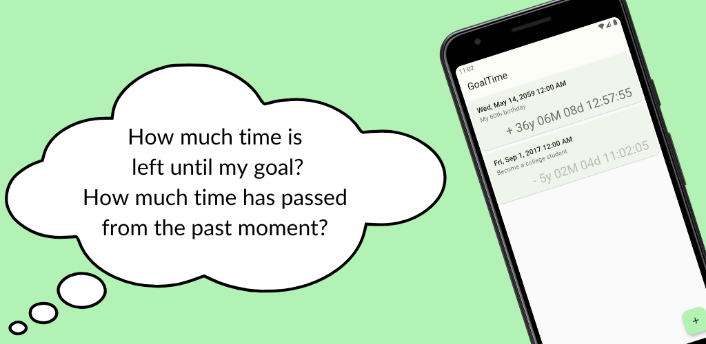

# Time Counter



"Time Counter" is a Flutter application inspired by the movie "In Time".
It allows you to set goals with a specific deadline and visually track the remaining time, just like the time on the characters' arms in the movie.

For more details on the project's philosophy, see [CONCEPT.md](CONCEPT.md).

## Features

- **Goal Setting**: Set multiple goals with a future date, time, and a description.
- **Countdown**: Displays the remaining time for each goal in years, days, hours, minutes, and seconds.
- **List View**: View all your set goals in a list.
- **Data Persistence**: Your goals are saved locally on your device.
- **Dynamic Theming**: Supports both light and dark modes, and adapts to your system's theme.

## Architecture

This project adopts a multi-package structure to separate concerns and improve modularity.

```
time_counter/
├── time_counter_flutter_app/      # Main Flutter application (UI layer)
├── time_counter_flutter_library/  # Shared Flutter widgets and UI-related logic
└── time_counter_library/          # Core Dart business logic and data models
```

### `time_counter_library`

- A pure Dart package.
- Contains the core business logic, such as data models (`GoalEntity`) and the repository pattern for data persistence (`GoalRepository`).
- Uses the `hive` package for local database storage.

### `time_counter_flutter_library`

- A Flutter package.
- Provides shared UI components and Flutter-specific logic that is independent of the main application's state.
- Depends on `time_counter_library`.

### `time_counter_flutter_app`

- The main Flutter application.
- Contains the app's entry point (`main.dart`), screen implementations (`CountdownView`, `CountdownListView`), and state management setup.
- Uses `provider` for state management.
- Integrates all other packages to build the final application.

## How to run

### Debug mode

1.  Navigate to the application directory:
    ```shell
    cd ./time_counter_flutter_app
    ```
2.  Create a `.env` file for development environment variables. You can use your test AdMob unit IDs.
    ```shell
    cat <<EOF > .env
    AD_UNIT_ID=your-test-unit-id
    APP_ID=your-test-app-id
    EOF
    ```
3.  Run the app in debug mode:
    ```shell
    flutter run --debug
    ```

### Release mode

1.  Navigate to the application directory:
    ```shell
    cd ./time_counter_flutter_app
    ```
2.  Run the app with release configuration. Replace with your actual AdMob App ID and Ad Unit ID.
    ```shell
    APP_ID=your-app-id flutter run --release --dart-define=AD_UNIT_ID=your-unit-id
    ```
